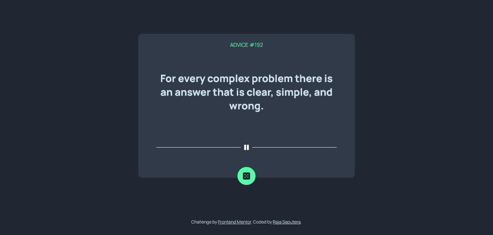
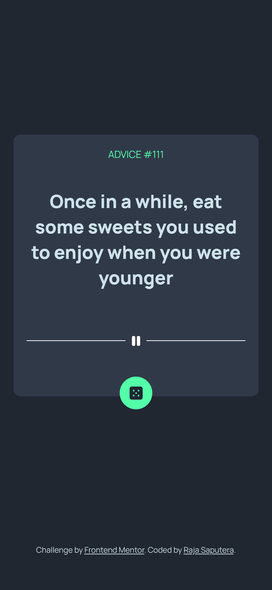

# Frontend Mentor - Advice generator app solution

This is a solution to the [Advice generator app challenge on Frontend Mentor](https://www.frontendmentor.io/challenges/advice-generator-app-QdUG-13db). Frontend Mentor challenges help you improve your coding skills by building realistic projects.

## Table of contents

- [Overview](#overview)
  - [The challenge](#the-challenge)
  - [Screenshot](#screenshot)
  - [Links](#links)
- [My process](#my-process)
  - [Built with](#built-with)
  - [What I learned](#what-i-learned)

## Overview

### The challenge

Users should be able to:

- View the optimal layout for the app depending on their device's screen size
- See hover states for all interactive elements on the page
- Generate a new piece of advice by clicking the dice icon

### Screenshot

<!--  -->

<p align="center">


</p>

### Links

- Solution URL: [Add solution URL here](https://your-solution-url.com)
- Live Site URL: [Add live site URL here](https://your-live-site-url.com)

## My process

### Built with

- Semantic HTML5 markup
- CSS custom properties
- Flexbox
- CSS Grid

### What I learned

Use this section to recap over some of your major learnings while working through this project. Writing these out and providing code samples of areas you want to highlight is a great way to reinforce your own knowledge.

To see how you can add code snippets, see below:

```html
<button href="#" class="round-button">
  
</button>
```

```css
.text-box__line {
  display: grid;
  grid-template-columns: 1fr max-content 1fr;
  grid-column-gap: 1rem;
  align-items: center;
  font-size: 2rem;
  color: white;
  font-weight: 800;
  margin-bottom: 3rem;
  flex: 1;
}
```

```js
const showQuote = async () => {
  try {
    const res = await fetch("https://api.adviceslip.com/advice");
    if (!res.ok) {
      throw new Error("No advice found");
    }
    const { slip } = await res.json();
    const randomID = Math.floor(Math.random() * 100);
    console.log(randomID);
    quoteID.textContent = slip.id;
    quote.textContent = slip.advice;
  } catch (err) {
    console.error(err);
  }
};
```
